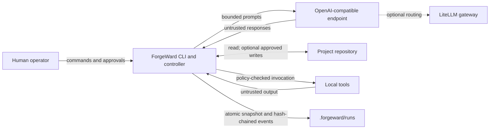

# Architecture

> **Status:** alpha design and implementation contract. Details may change before `1.0`. ForgeWard is not a sandbox, a security certification, or an unattended deployment system.

ForgeWard is a local-first CLI that coordinates a small set of specialized LLM roles through a deterministic, gated software-delivery lifecycle. The model proposes work; the controller owns state, permissions, and gates; the operator owns the final decision.

The design follows four rules:

1. Treat all model output as untrusted input.
2. Keep workflow control outside the model.
3. Require evidence and human approval at consequential boundaries.
4. Keep the repository and local run record as the systems of record.

## System context



ForgeWard itself has no analytics or remote control plane. Calls to the configured model endpoint are intentional network traffic and may carry repository context. A provider or operator-managed gateway may have its own logging, retention, and telemetry behavior.

## Components

| Component | Responsibility | Security boundary |
| --- | --- | --- |
| CLI | Parse commands, display state, collect explicit approvals | User input is validated before changing engagement state |
| Engagement controller | Advance the lifecycle, schedule roles, enforce dependencies, resume interrupted work | Deterministic code is authoritative; an LLM cannot set state directly |
| Role runner | Build a bounded context and invoke one role | Role prompts grant duties, not ambient authority |
| Provider port | Send and validate the supported OpenAI-compatible request/response subset | Provider responses are untrusted and capability differences are explicit |
| Policy and tool broker | Decide whether a proposed operation is allowed for this stage and role | A policy decision precedes execution; policy is not an OS sandbox |
| Gate evaluator | Check required artifacts and record human decisions | The producer of an artifact cannot approve its own gate |
| Evidence recorder | Append lifecycle events and update the materialized run snapshot | Hash chaining detects ordinary edits but does not defeat a hostile local administrator |
| Reporter/exporter | Render a reviewable summary and copy the engagement evidence | Export does not make sensitive content safe to publish |

The deterministic engagement controller is ForgeWard's orchestrator; it is not an LLM role. Product, architecture, and scrum-master roles may recommend sequencing or resolve planning dependencies. Only the controller can advance state, grant a capability, or accept an approval.

## Lifecycle

The persisted state machine is:

```text
CREATED → INTAKE → DISCOVERY → DESIGN → PLAN_GATE → EXECUTION
        → VERIFICATION → RELEASE_GATE → COMPLETE
```

Transitions are monotonic in the normal path. Rejection and failure are recorded events that stop forward progress; they do not silently reinterpret the previous state. `forgeward resume RUN_ID` reconstructs the next permitted action from durable state rather than asking a model what happened.

| State | Primary work | Required output or decision |
| --- | --- | --- |
| `CREATED` | Create an engagement identifier and baseline repository metadata | Durable run record |
| `INTAKE` | Capture objective, scope, constraints, and operator intent | Brief and acceptance criteria suitable for planning |
| `DISCOVERY` | Inspect the project and identify dependencies, risks, and unknowns | Discovery notes and initial threat hypotheses |
| `DESIGN` | Produce acceptance criteria, UX/architecture decisions, threat model, and implementation plan | Reviewable plan and security assumptions |
| `PLAN_GATE` | Human reviews scope, plan, and known risks | Explicit `approve` or `reject` event |
| `EXECUTION` | Builders produce proposed changes when application is explicitly enabled | Traceable patch/change artifacts |
| `VERIFICATION` | Test, review, and security roles evaluate the result | Test results, findings, and unresolved-risk list |
| `RELEASE_GATE` | Human reviews changes and verification evidence | Explicit release approval or rejection |
| `COMPLETE` | Freeze the engagement outcome and render the report | Final status and evidence pack |

The plan and release gates are human gates by default. `forgeward run "objective" --apply` opts into applying permitted changes during execution; it does not bypass either gate or authorize merge, push, package publication, or deployment.

## Roles and teams

Roles have artifact contracts and capability limits, not merely different personas.

| Role | Owns | Must not do |
| --- | --- | --- |
| Product | Problem statement, acceptance criteria, scope decisions | Implement or approve its own criteria |
| Designer | User flows, interaction states, accessibility notes | Treat visual polish as acceptance evidence |
| Architect | Component boundaries, interfaces, design decisions | Grant runtime permissions |
| Scrum master | Backlog, dependencies, impediments, progress summary | Override a failed gate |
| Builder | Proposed code and focused implementation notes | Self-approve, merge, push, or deploy |
| Reviewer | Correctness and maintainability findings | Rewrite evidence to hide a failure |
| Tester | Test plan, execution results, reproducible failures | Convert a skipped check into a pass |
| Security | Threat model, abuse cases, security findings | Claim the workflow is a security audit |
| Release | Changelog, readiness summary, handoff checklist | Approve the human release gate |

Teams group roles and select a provider alias per role. In `0.1`, the provider alias selects the model; configure multiple aliases to use different models for different roles. Model diversity can reduce some correlated errors, but it is not an independence guarantee. Gate criteria and executable evidence remain authoritative.

## Commands and control flow

The public command surface is organized around the lifecycle:

```text
forgeward init
forgeward doctor
forgeward context preview
forgeward plan "objective"
forgeward run "objective" [--apply]
forgeward resume RUN_ID
forgeward status [RUN_ID] [--json]
forgeward approve RUN_ID GATE
forgeward reject RUN_ID GATE --reason "..."
forgeward inspect RUN_ID
forgeward report RUN_ID
forgeward export RUN_ID
forgeward provider list|test
forgeward team list|validate
forgeward policy check
```

`plan` stops at the plan gate. `run` drives as far as policy and outstanding human decisions permit. `status` and `inspect` are read-only views. Approval commands are separate so a model-generated answer cannot be confused with an operator decision.

## Local configuration and state

Project configuration lives under `.forgeward`, with the team/provider policy rooted at `.forgeward/firm.yaml`. Credentials are referenced by environment-variable name; they must not be embedded in project configuration.

Each engagement has a directory under `.forgeward/runs/<run-id>/`. The MVP persistence model is:

- an atomically replaced `run.json` snapshot for fast reads;
- an append-oriented, hash-chained `events.jsonl` history;
- generated role and verification artifacts; and
- reports or exports derived from those records.

`run.json` drives current alpha control flow, while `events.jsonl` provides an audit history. Every event binds a digest of the complete semantic run projection, excluding only ledger bookkeeping and update time. Resume, inspection, reporting, export, and gate decisions verify the chain head, projection checkpoint, and recorded artifact bytes. Full reconstruction of `run.json` by replaying events is not an MVP guarantee. The chain is tamper-evident under normal operation, not immutable storage: a user with write access to the whole directory can rewrite the history.

SQLite is intentionally not required for the MVP. It may be introduced when multi-process scheduling or query needs justify the extra migration and locking surface.

## Provider boundary

The core depends on a conservative subset of the OpenAI Chat Completions request and response shape. A directly compatible endpoint is the smallest deployment. That direct adapter rejects non-loopback HTTP by default, ignores ambient proxies, streams a byte-bounded decoded response, and suppresses upstream error bodies. LiteLLM is an optional adapter/gateway for providers that require translation, centralized routing, or provider-specific authentication. In-process LiteLLM delegates endpoint/proxy/CA behavior and initial response allocation to LiteLLM; ForgeWard's content limit applies after the SDK returns. Use a separate HTTPS LiteLLM gateway through the direct adapter when the stricter transport boundary is required. Provider errors are normalized before entering controller state.

Provider-specific capabilities are declared and probed; they are not inferred from a model name. JSON-schema response format, token accounting, streaming, and sampling parameters can differ even when an endpoint advertises OpenAI compatibility. Native provider tool calls are not consumed by the `0.1` adapter. See [Provider abstraction](provider-abstraction.md).

## Tool execution

Proposed actions flow through four separate decisions:

1. Is the action valid for the current lifecycle state?
2. Is the action in the role's declared capabilities?
3. Does project policy allow its command, path, and network effects?
4. Does the action require a fresh human approval?

An allow result means only that ForgeWard policy permits the operation. The operating system ultimately controls process, filesystem, and network isolation. Per-role containers, isolated Git worktrees, and stronger command mediation are roadmap work, not MVP guarantees.

Check output retained as evidence is drained and bounded in memory. POSIX timeouts terminate the check's
process group. Portable Windows execution can terminate only the direct process, so descendants require
external job-object, container, or CI-runner containment. Builder changes are create/update proposals;
delete, rename, and rollback corrections require deliberate cleanup and a new run.

## Failure and recovery

Every durable state change is written as an event before the latest snapshot is exposed. Provider errors, malformed output, policy denial, gate rejection, tool failure, and interruption are recorded distinctly. Retries must be bounded and idempotent at the controller level; retrying a provider call must never replay a write operation implicitly.

On resume, ForgeWard continues from the persisted `run.json` phase after verifying event-chain order and hashes, the final count/head, the semantic projection checkpoint, and every recorded artifact. Applying changes also checks the Git base and recorded workspace digests at the relevant boundaries. If integrity cannot be established, the command stops for operator review. Event replay, effective-policy binding, signatures, and external anchoring remain hardening targets.

## Secure-development lifecycle mapping

ForgeWard is inspired by the [NIST Secure Software Development Framework (SP 800-218)](https://csrc.nist.gov/pubs/sp/800/218/final), but using ForgeWard does not establish SSDF compliance.

| SSDF area | ForgeWard mechanism |
| --- | --- |
| Prepare the Organization | Versioned team, provider, and policy configuration; explicit role responsibilities |
| Protect the Software | Least-privilege role capabilities, local records, human gates, secret-by-reference configuration |
| Produce Well-Secured Software | Threat modeling, design artifacts, review, testing, and security verification before release |
| Respond to Vulnerabilities | Structured findings, run history, release evidence, and a private reporting process |

## Current limitations

The alpha architecture does not promise:

- protection from a malicious local user or administrator;
- safe processing of a hostile repository without external sandboxing;
- cryptographic human identity or remotely anchored attestations;
- per-role worktree, VM, or container isolation;
- an SBOM, provenance attestation, or signed release artifact;
- semantic equivalence across providers or models;
- multi-user concurrency or a hosted authorization layer;
- in-process LiteLLM transport or network-allocation enforcement;
- portable Windows descendant-process containment;
- delete, rename, or rollback proposals within a corrective run; or
- autonomous merge, push, publication, or deployment.

Those limitations are intentional inputs to the [roadmap](roadmap.md) and [threat model](threat-model.md), not implicit promises.
