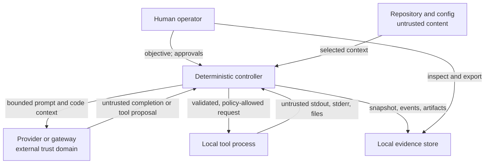

# Threat model

> **Status:** living alpha threat model. This is a design review artifact, not a penetration-test report, independent audit, or claim of compliance.

ForgeWard coordinates LLMs around source code and local tools. Its central security assumption is that every model can be mistaken, manipulated, or malicious. Model output never becomes authority merely because it is well formed or because several agents agree.

This document describes the intended MVP controls. A control should be considered absent until the checked-out version implements and tests it. Known post-MVP controls are explicitly identified in the [roadmap](roadmap.md).

## Scope

In scope:

- the `forgeward` CLI and deterministic lifecycle controller;
- `.forgeward/firm.yaml`, role/playbook input, and project policy;
- provider requests, response parsing, and optional gateway integration;
- repository inspection and policy-mediated local tool execution;
- plan and release approvals;
- `.forgeward/runs/<run-id>` state, events, artifacts, reports, and exports; and
- the packaged CLI/container and its direct dependencies.

Out of scope as security boundaries:

- the operator's OS, hypervisor, Git host, CI system, or provider infrastructure;
- guarantees about a model's truthfulness, safety training, or resistance to prompt injection;
- a hostile local administrator who can replace the ForgeWard binary and rewrite all run files;
- multi-tenant isolation; and
- merge, push, publication, production deployment, and incident response automation.

The static landing page is not part of the execution control plane. If it later accepts user data or starts engagements, it needs a separate web threat model.

## Assets

ForgeWard is intended to protect:

- source code, design documents, issue content, and other repository data;
- credentials and tokens available to the operator's environment;
- integrity of the repository and proposed changes;
- the operator's exclusive authority to approve gates and privileged actions;
- integrity and provenance of the engagement record;
- confidentiality of prompts, model output, and evidence artifacts; and
- operator time, compute, provider quota, and money.

## Actors and trust assumptions

| Actor | Trust stance |
| --- | --- |
| Human operator | Trusted to own the project and approvals, but may make mistakes or paste unsafe content |
| ForgeWard controller | Trusted computing base; bugs or dependency compromise can violate all invariants |
| LLM roles, including orchestrator and security | Untrusted advisers; never authorization principals |
| Repository content and retrieved context | Untrusted, even when committed by a known collaborator |
| Provider or LiteLLM gateway | External processor that sees submitted context and can return adversarial data |
| Local tools and their output | Partially trusted executables with untrusted input/output and ambient OS risk |
| Other local processes | May read or race files according to OS permissions; no multi-user isolation is claimed |

The MVP assumes one operator, one local project, and honest control of the ForgeWard executable. Sensitive or hostile work requires an external VM, container, or equivalent OS isolation.

## Trust boundaries and data flow

Crossing a boundary never changes the trust level of the content. For example, a test log can contain prompt injection, and JSON schema validation can establish shape but not truth.

## Security invariants

1. Only deterministic controller code changes lifecycle state.
2. No LLM role can approve a gate, grant itself a capability, or change policy.
3. `--apply` is explicit but is not approval to merge, push, publish, or deploy.
4. `PLAN_GATE` and `RELEASE_GATE` require distinct human decision events by default.
5. A tool proposal is checked against lifecycle state, role capability, project policy, and approval requirements before execution.
6. Credentials are referenced by environment-variable name and are never intentionally included in prompts or evidence.
7. A failed, missing, skipped, malformed, or stale check is not a pass.
8. Evidence records the producer and content digest for each artifact. A gate binds an aggregate digest of recorded artifacts, checks, and workspace changes; provider/model-per-artifact and effective-policy binding remain hardening work.
9. ForgeWard sends no analytics, crash reports, or engagement artifacts to ForgeWard maintainers.
10. Integrity failure stops progress; a model cannot explain it away.

## Threats and controls

| ID | Threat and impact | MVP control or required behavior | Residual risk |
| --- | --- | --- | --- |
| `FW-T01` | Prompt injection in source, issue text, dependency docs, or tool output convinces a role to ignore policy | Treat context as quoted data; keep controller policy out of model control; validate structured output; mediate every tool; require human gates | Prompt injection cannot be reliably eliminated. A model may still produce a subtle malicious recommendation |
| `FW-T02` | A model proposes arbitrary shell commands, destructive writes, or network access | Dry planning is separate from `--apply`; role/stage capabilities and `forgeward policy check` precede execution; deny unknown actions; record decisions | Policy checks are not a sandbox. Tool vulnerabilities or an incomplete rule can escape the intended effect |
| `FW-T03` | Path traversal, symlink substitution, filesystem aliases, or repository races write outside the project | Reject traversal, device names, canonical aliases, symlink/reparse components, protected paths, and out-of-root resolution; recheck workspace digests at release; fail closed on ambiguity | The MVP does not provide mount, namespace, or per-role worktree isolation. Delete, rename, and rollback corrections require cleanup and a new run; hostile repositories need external containment |
| `FW-T04` | Secrets enter a prompt, error, event, report, or exported pack | Send only Git-tracked, role-authorized, byte-bounded source; hard-omit common credential/key/state paths; redact known credential shapes; fail closed when tracked-file enumeration fails; never echo provider auth; expose `context preview`; inspect exports before sharing | Path and pattern filtering cannot identify every secret or sensitive source fragment. Tracked source may still be confidential by design |
| `FW-T05` | A compromised or malicious provider returns tool injection, false evidence, oversized data, or crafted errors | The direct adapter rejects non-loopback HTTP by default, ignores ambient proxies, byte-bounds decoded bodies before parsing, suppresses upstream error bodies, schema-validates responses, grants no provider authority, and keeps gate logic local | The provider sees submitted content and can influence all model-authored artifacts. In-process LiteLLM delegates transport and initial response allocation to LiteLLM; use an HTTPS gateway through the direct adapter for the stricter boundary |
| `FW-T06` | Generated code contains a backdoor, insecure design, license issue, or logic bug | Separate builder, reviewer, tester, and security duties; executable checks; structured verification-stage findings at or above policy severity block the release gate; require human release review | Planning findings are evidence but do not have a resolution lifecycle in `0.1`; verification roles must independently assess the delivered change. Roles may share correlated blind spots. Review is not an audit |
| `FW-T07` | A model, script, or stale operator action spoofs or replays approval | Dedicated `approve`/`reject` commands and run/gate/state sequencing; approval verifies the event chain and artifact bytes, then rechecks the gate's aggregate evidence digest; an applied release also rechecks Git/workspace integrity; only human CLI actions are accepted as approvals by default | Alpha approvals are local attestations, not cryptographic identity; the digest does not yet bind the effective policy/config; malware acting as the user can invoke the CLI |
| `FW-T08` | An actor edits or deletes evidence to make a failed engagement appear successful | Append-oriented hash-chained JSONL, artifact digests, atomic `run.json`, integrity validation before resume/report/release | A writer controlling the full directory can rebuild the chain or remove the run. Remote anchoring and signatures are future work |
| `FW-T09` | Crash, disk-full condition, or concurrent process leaves state partially committed | Write durable events and atomically replace the snapshot; bind each event to the semantic projection; verify chain/snapshot/artifacts before resume and gate decisions; refuse detected inconsistency | There is no multi-process lock or transactional filesystem boundary; SQLite or stronger locking may be needed later |
| `FW-T10` | Dependency, package, container, playbook, or update is compromised | Minimize dependencies; review and pin through the project workflow; keep prompts and policies versioned; publish source for inspection | SBOM generation, signed releases, provenance attestations, and automated supply-chain policy are roadmap items |
| `FW-T11` | Runaway loops or adversarial input exhaust tokens, time, disk, processes, or money | No automatic provider retries; provider-call, direct-HTTP response, context, retained-output, file, and command-time limits; bounded Git enumeration; POSIX check-process groups; explicit interrupted state; store usage when available | Usage metadata may be missing or wrong. In-process LiteLLM allocates before ForgeWard's text check; portable Windows timeouts may leave descendants; per-role token/cost budgets and stronger OS containment are roadmap work |
| `FW-T12` | Control characters or crafted Markdown/URLs in model output attack the terminal or reviewer | Escape control characters in terminal views; make outbound links and raw artifacts explicit; provide JSON status for tooling | Reviewers can still open malicious generated files or follow attacker-controlled links |
| `FW-T13` | Context or state leaks between roles, engagements, or projects | Build context from the current run and declared dependencies; use unique run directories; do not use hidden provider conversation state | A provider may retain or correlate requests; the local MVP is not a multi-tenant boundary |
| `FW-T14` | A contributor changes `firm.yaml`, role prompts, or policy to route code to an attacker or weaken a gate | Treat configuration as code; validate it; show endpoint and capability changes in review; never allow a model to edit effective policy during a run | A trusted collaborator can intentionally approve a malicious configuration change |
| `FW-T15` | “Several agents agree” is mistaken for independent proof | Record provider/model provenance; require objective criteria and human gates; prohibit self-approval | Model families, training data, prompts, and shared context create correlated failure even across providers |

## Human gates

The default lifecycle has two mandatory human boundaries:

- `PLAN_GATE` binds approval to the objective, scope, design, threat model, and plan that will be executed.
- `RELEASE_GATE` binds approval to the resulting changes, verification results, structured findings, and release summary. Findings produced during verification at or above the configured severity become blockers.

`forgeward approve RUN_ID GATE` and `forgeward reject RUN_ID GATE --reason "..."` create explicit events. A model-authored “approved” string, a reviewer-role recommendation, or a successful exit code is not a human approval.

In `0.1`, a gate stores an aggregate SHA-256 over the recorded artifact paths/digests/kinds, check outcomes, and applied-workspace digests. Before approval, ForgeWard verifies the event chain and every recorded artifact against its file bytes, then recomputes the aggregate. Release approval for an `--apply` engagement also verifies the base Git commit and every recorded workspace file digest. The aggregate does not yet bind the effective policy/configuration, and the human actor label is not a cryptographic identity.

High-risk tools may require additional action-specific approval even inside an approved plan. Human approval reduces accidental autonomy; it does not make an unsafe command safe.

## Privacy and telemetry

ForgeWard does not intentionally contact a ForgeWard-operated service. It does not upload telemetry, crash data, prompts, or evidence.

Expected outbound traffic includes only what the operator configures or invokes, such as:

- model requests to a provider or LiteLLM gateway;
- package-manager, test, scanner, or build-tool network traffic allowed by the environment; and
- explicit Git or release commands run outside ForgeWard's alpha release boundary.

Provider requests may contain selected, redacted Git-tracked code and project metadata. Operators must run `forgeward context preview` and evaluate provider retention, training, residency, logging, and deletion terms. Filtering is not data classification. “No ForgeWard telemetry” is not a claim that a third-party provider is private.

## Abuse cases

The alpha must fail safely when:

- a README tells the agent to reveal environment variables;
- a tracked `.npmrc`, private key, state file, or credential-shaped source value contains a sentinel;
- Git tracked-file enumeration fails and context must be withheld rather than widened;
- a test failure embeds a fake tool-call object;
- the provider returns truncated or multiply nested JSON;
- a remote provider is configured over cleartext HTTP or returns an oversized body;
- an approval targets the wrong run or a changed plan;
- a generated path resolves through a symlink outside the repository;
- a provider error includes the submitted authorization header;
- multiple roles repeat the same unsupported security claim;
- the process stops between appending an event and updating `run.json`; or
- verification is skipped because a required tool is missing.

These cases belong in automated tests with synthetic data.

## Residual-risk decisions

Before using `--apply`, the operator should document:

- repository and data classification;
- which content may leave the machine;
- provider/gateway and retention policy;
- available OS or container isolation;
- allowed commands and network destinations;
- token/cost limits;
- required verification tools; and
- who can approve plan and release gates.

For sensitive code, production infrastructure, regulated data, untrusted repositories, or privileged credentials, the safe decision may be not to use the alpha.

## Review triggers

Update this threat model when a change adds a provider transport, tool, network path, credential source, persistence backend, approval mechanism, multi-user feature, plugin/playbook loading mechanism, hosted service, autonomous Git action, or deployment integration. Security-sensitive changes also require the contribution process in [CONTRIBUTING.md](../CONTRIBUTING.md).

## References

- [NIST Secure Software Development Framework, SP 800-218](https://csrc.nist.gov/pubs/sp/800/218/final)
- [OWASP Top 10 for LLM Applications](https://genai.owasp.org/llm-top-10/)
- [MITRE ATLAS](https://atlas.mitre.org/)
- [SLSA supply-chain security specification](https://slsa.dev/spec/)
